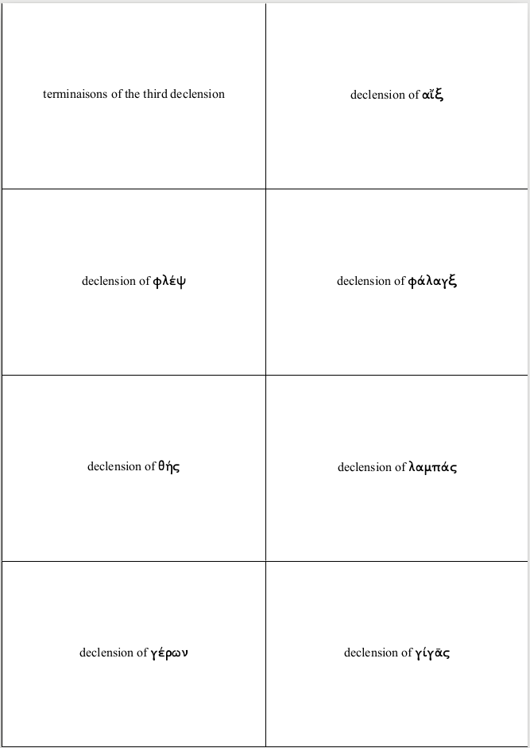
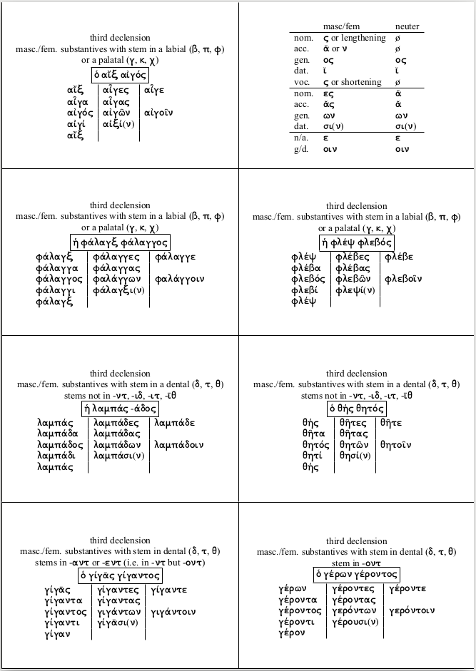

# Prepare Flashcards To Print On Paper Sheets

Prepare a set a flashcards to be printed on (by default A4) paper
sheets with (Lua)Latex.  The scripts produces a `.tex` file.

Here is an example.  You write some questions and answers, which you can
format using Latex commands, in a text file.  You then run `mkfcs.pl` to
get a latex file that you compile to have a pdf file, with an even
number of pages: one side contains the questions, the other the ansers
(you have to print on both side, of course).  There are several
flashcards sizes you can choose from.

The question side (third declension of Ancient Greek):



The answer side:




## Usage

Assuming you have a at least one files of questions and answers (see
below), run:

```
perl mkfcs.pl -b -o=<output.tex> <input_file> [<input_file>[, ...]]
lualatex output.tex
```

With the `-b` switch, borders are drawn around each card.

Choose the number of flashcards per page you want with the `-t` option,
e.g. `-t=12`.  By default, you can choose between 8, 12 or 18.  You can
define your own format by editing the `Templates.pm` module.

With you the `-h` and `-H` switches, you can get online help.

Note that input file names that begin with '#' are ignored, so you can use
paths from a file:

```
cat file-list | xargs perl mkfcs.pl
```

## Custom preamble

You can (but are not required to) create a `preamble.tex` file in the
current directory containing settings that you want to save and share between
calls of `mkfcs.pl` script.  The presence (or absence) of this file will
be automatically detected.

For example, if you want to set the same font for all the flashcards you
create from several calls of `mkfcs.pl`, create a `preamble.tex` file
containing:

```
\setmainfont{Times New Roman}
```


## Questions and Answers format

The file(s) containing the questions and answers is formatted as
follows

White lines before the question and after the answer are ignored.

Question/Answer pairs are separated by white lines.  That means that
there must be no white line in a Question/Answer pair (use the LaTeX
comment sign, if you want).

Question and Answer are separated by:

- a line containing a single colon `:` (spaces before and after are allowed),
- or by a double colon `::` anywhere on a line.

Lines beginning by % are ignored (comments).

Here is an example:

```
question
:
answer

question::answer

question
::answer
```

See other examples in the `samples` directory.

## Advanced stuff

You can use some formatting options in the format `%%option-name:value`.
The options are as follows:

- `question-size`: the size (normalsize, large, Large, etc.) for all
  the following questions in the file.  The default value is `Large`,
  and this value is reset for each new file
- `answer-size`: same as above, but for answers
- `question-font`: if not empty, a command `\\<MyFont>{...}` is added
  around all the following questions in the file.  The default value
  is nothing, and this value is reset for each new file.
- `answer-font`: same as above, but for answers
- `define`: define a macro which can be use later (in a option only)
  with the syntax `\$macroname`.  The value of the option is
  `macroname=value`.

Here is an example of a file:

```
%%define:default-question-size:large
%%question-size:\\\$default-question-size

question
:
answer

%%question-size:Huge
question::answer
%%question-size:\$default-question-size

question
::answer
```


